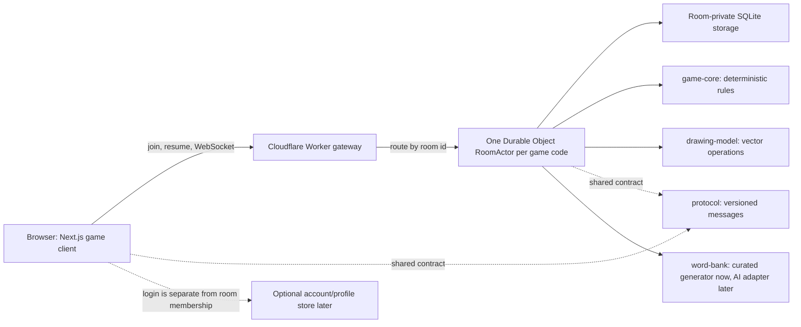

# Architecture overview

Status: **accepted direction for the first playable version**. Product rules
explicitly marked as hypotheses still need playtesting or user confirmation.

## Mental model

Each game room is one small, authoritative state machine. Browsers send
commands such as “join,” “append these stroke points,” or “submit this guess.”
The room validates the command, advances its ordered state, persists important
changes, and sends each player only the view they are allowed to see.

This is a hybrid, not a contradiction: the repository and product are modular,
while the realtime room is a deliberately stateful actor. One deployment does
not mean one undifferentiated codebase.

## Driving characteristics

The initial architecture is optimized for four outcomes, in order:

1. **Low perceived latency.** Drawing is rendered locally on the next frame;
   network confirmation and remote fan-out happen behind that local echo.
2. **Reconnectability.** Refreshing or backgrounding Safari may destroy a
   socket, but it must not destroy player identity or room membership.
3. **Correct competitive state.** One server orders phases, guesses, deadlines,
   roles, and points. A client never awards itself points or extends a timer.
4. **Evolvability.** New games and future AI word sources fit behind explicit
   package boundaries without distributing the whole system prematurely.

The measurable guards for these claims live in
[fitness-functions.md](../quality/fitness-functions.md).

## Component boundaries

| Boundary                 | Owns                                                                                             | Must not own                                            |
| ------------------------ | ------------------------------------------------------------------------------------------------ | ------------------------------------------------------- |
| `apps/web`               | Pages, canvas rendering, keyboard-safe layout, optimistic UI, reconnect client                   | Authoritative scoring or phase transitions              |
| `apps/realtime`          | Room routing, WebSockets, Durable Object storage, authentication adapters, role-specific fan-out | React UI or game-specific formulas embedded in handlers |
| `packages/game-core`     | Deterministic commands, state transitions, settings, scoring, role rotation                      | Clocks, sockets, databases, Cloudflare, or React        |
| `packages/drawing-model` | Strokes, semantic operations, object erase, undo/redo, snapshots                                 | Network transport or DOM canvas APIs                    |
| `packages/protocol`      | Versioned envelopes, runtime schemas, public projections                                         | Hidden room state or business decisions                 |
| `packages/word-bank`     | Validated candidates, curated fallback, generation port, and provenance                          | AI SDKs, credentials, prompts, or realtime room I/O     |

Each additional game gets a rules module and protocol vocabulary. It may reuse
the existing room runtime. If it later proves a different operational profile,
it can gain another app/deployable while remaining in this monorepo.

## Authoritative command flow

1. A client sends a versioned command with a unique `clientCommandId`.
2. The room authenticates the room-scoped resume token and checks the player's
   role, the current phase, the server deadline, size limits, and command shape.
3. The deterministic reducer returns either a rejection or a new state plus
   domain events.
4. Important state is persisted before success is announced. High-frequency
   drawing points are batched; completed strokes and semantic edits are
   checkpointed.
5. The room increments `roomVersion` and `serverSeq`, then emits a projection
   appropriate to each role. A team's guessers never receive their own answer,
   and no browser receives raw opponent drawing operations.

Duplicate command IDs return the original result or a no-op. This makes retries
safe when a client cannot know whether a reply was lost.

## Time and phase changes

The room stores absolute `phaseStartedAt` and `phaseDeadlineAt` timestamps from
the server clock. Clients receive the deadline and render a smooth local
countdown, but that countdown is presentation only.

Every incoming command first advances any expired phase. A Durable Object alarm
also wakes the room around the deadline so the game can progress when nobody is
sending messages. Alarms may be delayed during failure recovery, so correctness
comes from rejecting actions after the stored deadline—not from assuming a
callback fires at an exact millisecond.

## Identity, refresh, and mobile backgrounding

A WebSocket is a disposable transport, not a player. First join creates a
stable `playerId` and a cryptographically random, room-scoped `resumeToken`.
Only a hash of the token is stored server-side. The browser retains the token
in durable local storage; a logged-in account may later provide a second path
to recover it.

On socket open, the client sends the token and its last applied `serverSeq`.
The room either sends the missing bounded event tail or a fresh role-specific
snapshot. A connection generation prevents an old socket from acting after a
new one replaces it.

The client reconnects on socket close and when `pageshow`, `online`, or a return
to visible state reveals a dead connection. Retries use capped exponential
backoff with jitter. Membership remains until room retention expires; presence
is merely the current connection state. Returning after the round ends should
open the current round or final stats, never the lobby by accident.

## Drawing transport

Pointer input is rendered locally immediately. Normalized vector points are
resampled and batched into small frames, then sent over the room socket. The
server validates the active drawer and assigns canonical ordering before
broadcasting to that team. The browser watches `WebSocket.bufferedAmount` and
degrades sampling before an unbounded queue can freeze the page.

The opponent preview is a separate, coarse server-derived projection. Raw
opponent vectors are not delivered and then hidden with CSS, because a player
could remove that filter in developer tools.

See [ADR 0003](../decisions/0003-vector-drawing-model.md).

## Persistence and recovery

Persist synchronously when losing the state would change the winner or strand a
player: membership tokens, settings, phase/deadline, both selected prompts, accepted
guesses, scores, rotation, and rematch state. Persist completed drawing actions
in batches and checkpoint canvases. Presence, interpolated timers, and an
unfinished pointer stroke are reconstructable or safely disposable.

This is not full event sourcing. A current snapshot plus a bounded event tail
provides reconnect and debugging value without committing the product to
permanent replay, schema-upcasting, and deletion complexity.

## Accounts and future AI

Guest play by game code is the first path. Login is optional identity for
cross-device profiles, friends, and long-term statistics; it must not be
required to recover a live room on the same device.

Word generation depends on the `WordBankGenerator` contract, whose unknown
output must become validated, difficulty-labelled candidates. The default
implementation is a deterministic curated bank. A future AI adapter may
generate topic-specific banks, but its output must
pass deterministic validation, moderation, deduplication, cost limits, and a
fallback bank before entering a room. No model call belongs in the realtime
stroke path.

## Decisions versus hypotheses

### Accepted decisions

- One modular monorepo, with extraction only after measured need.
- Next.js for the web product and one Cloudflare Durable Object per room.
- Server-authoritative rules and deadlines.
- Resume identity independent of WebSocket lifetime.
- Vector drawing operations with local optimistic rendering.
- Curated word bank behind a future-proof `WordBankGenerator` boundary.

### Hypotheses to validate

- A representative room is at most 16 players and two active drawing streams.
- One room actor remains comfortably within CPU, memory, message, and storage
  limits at that load.
- A short disconnect grace plus role handoff feels fairer than pausing everyone.
- The first account store and authentication provider should be selected only
  after guest reconnect works end to end.
- Cross-region friend groups are satisfied by optimistic local drawing and the
  room actor's placement; measurements may justify another topology later.
