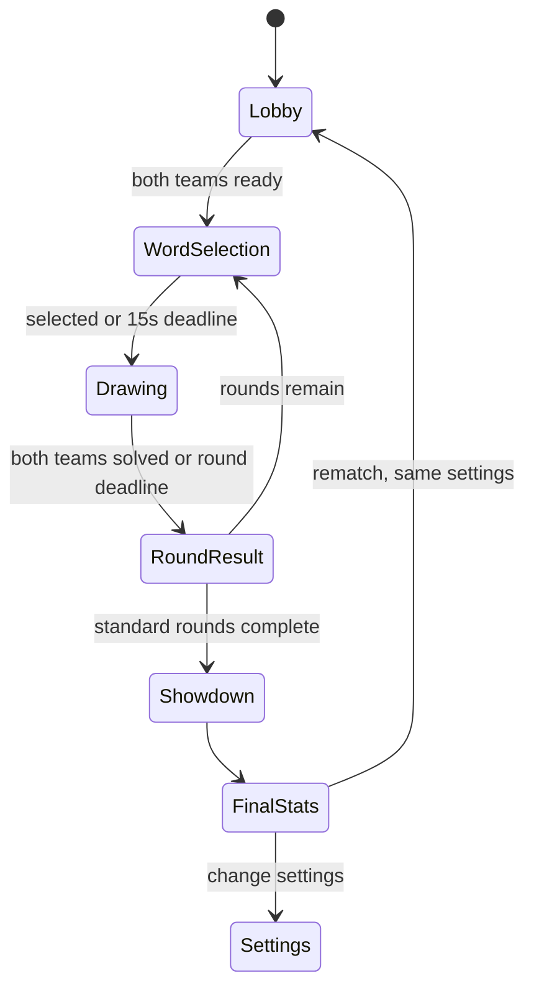

# Dual Draw product specification

Status: **working product contract**. Items labelled “hypothesis” are proposed
defaults, not settled user decisions.

## Product promise

Each team receives its own secret prompt. One active drawer on each team draws
simultaneously while their own teammates guess. The game rewards fast guesses,
hard prompts, and comebacks without making the winning team feel cheated.

The experience must remain usable on a phone: drawing stays visible while a
guesser types, pressing Enter does not scroll the canvas away, and returning
from another app resumes the live match.

## Terms

- **Room:** a resumable game session entered with a short code.
- **Team:** Team A or Team B.
- **Active drawer:** the one player currently drawing for a team.
- **Guessers:** the active drawer's teammates for that round.
- **Word draft:** the 15-second period in which each active drawer chooses their
  team's prompt independently.
- **Round:** two concurrent word drafts, drawing/guessing, then scoring.
- **Showdown:** a redraw relay through each team's shuffled prior word set.

## Core loop



The room server, not a browser, owns every transition and deadline.

## Proposed default settings

| Setting                   |                                                Default | Allowed initially                          |
| ------------------------- | -----------------------------------------------------: | ------------------------------------------ |
| Players                   |                                              4 minimum | 2–8 per team, 16 total                     |
| Standard rounds           |                                                      6 | 4–16, even numbers                         |
| Word-selection time       |                                             15 seconds | Fixed for the first version                |
| Drawing time              |                                             90 seconds | 45, 60, 75, or 90 seconds                  |
| Round results             |                                              8 seconds | Fixed for the first version                |
| Word choices              |                                                      3 | 2–7                                        |
| Word replacements         |                                           1 per drawer | 0–5; shared across replacement reasons     |
| Opponent draft visibility |                                      Options + actions | Options + actions, actions only, or hidden |
| Word length               | Hidden; team-majority reveal after 30s costs 10 points | Shown, hidden, or reveal disabled          |
| Prompt difficulty         |                                                  Mixed | Easy, mixed, or hard-biased                |
| Colors                    |                   Accessible palette plus custom color | Host may restrict for modes later          |
| Stroke sizes              |                                              4 presets | Thin through extra thick                   |
| Showdown                  |                                        On; 120 seconds | On or off                                  |

Room settings are visible to everyone before ready-up. The host proposes
changes; the game starts only when every connected player marks ready.

## Teams, rotation, and word choice

Drawer rotation is independent and round-robin within each team, skipping
players only after their reconnect grace expires. Each team has one active
drawer and its own draft, prompt, canvas, guesses, and round score.

During the 15-second draft, each active drawer sees their candidate words and
difficulty labels and may select one or replace it for either of two explicit
reasons: **seen before** or **I do not know this word's definition**. Both
reasons consume the same configured replacement allowance; unfamiliarity does
not create an unlimited reroll path. At the deadline, the server randomly
selects one of that drawer's remaining candidates. The two drafts do not block
each other.

Replacement actions retain their reason, actor, and server timestamp for room
history and moderation. Opponents may observe the action only when the room's
draft-visibility setting permits it. A word's stored definition is editorial
metadata for the catalog and is never sent to guessers with a live answer.

To honor the intended social transparency, the casual-room default shows the
**opposing team** that drawer's offered options and every replacement action
while the drawer’s own guessers see only their team's selection status. Once
selection locks, each final answer is hidden from every guesser and from the
other drawer; it is delivered only to the drawer who chose it. The setting is
explicit and reversible before a match or between rounds:

- **Options + actions (default):** each opposing team sees the other
  drawer's candidate pool and replacements, but not a final-answer message.
- **Actions only:** the opposing team sees replacements without word text.
- **Hidden:** opponents see neither options nor draft actions.

Showing options creates a collusion path when friends share voice chat: an
opponent could relay the narrowed candidate pool to the owning team's guessers.
The exposure is symmetric, but not cheat-proof. A future ranked/public mode
should default to hidden; casual rooms retain the more playful transparent
default unless playtests show it ruins guessing.

A same-prompt race can be added later as a separate setting. It is not the
default because independent choices and difficulty bonuses are part of the
current competitive design.

The server avoids recently used room words and records seen reports separately
from correctness. A report is a personalization signal, not proof that a word
must be deleted globally.

## Drawing and guessing

Each team has its own canvas. The initial tool set is:

- freehand strokes with several sizes and an accessible color palette;
- tap-to-dot marks whose diameter follows the selected stroke size, for details
  such as strawberry seeds or eyes;
- object eraser that removes an entire stroke selected by hit testing;
- precise eraser as an optional later tool, not the only eraser;
- undo and redo for the active drawer's semantic actions;
- reversible clear-canvas action; and
- pointer support for touch, pen, and mouse.

The drawer sees local ink immediately. Guessers receive ordered vector updates
and can keep submitting guesses until their team solves the word or time ends.
A short tap commits one round, single-point stroke; beginning a drag must not
add a second dot beneath the line.
Guess matching is server-side, case-insensitive, whitespace-normalized, and
accent-tolerant. Fuzzy spelling tolerance is a later, bounded setting because
overly broad matching can reveal answers or accept wrong words.

The opponent view is deliberately unhelpful but entertaining: a low-frequency,
coarse grid derived by the server, followed by visual blur/pixelation. The raw
opponent strokes are never sent to the browser during the round.

### Stable mobile layout

The canvas is the stable primary pane. Guess history scrolls inside its own
region, and the guess composer is a keyboard-aware overlay or dock—not content
inserted above the canvas. Focusing the input uses `preventScroll`; submitting
the form keeps focus and does not navigate, reset the page, or change document
scroll position. Layout follows the visual viewport when the on-screen keyboard
opens, with safe-area insets respected.

Acceptance is behavioral: on supported iPhone and Android sizes, a player can
focus, type, submit a wrong guess, and type again while the same meaningful
portion of the drawing remains visible.

## Word-length reveal vote

Default: hide length. After 30 seconds, a team's guessers may vote to reveal
their own word length. More than half of that team's eligible guessers must
approve; drawers do not vote, ties fail, and each guesser gets one vote. A
recently disconnected guesser remains in the electorate until the reconnect
grace expires, preventing a momentary Safari suspension from changing quorum.

A successful reveal displays blanks only to that team and deducts 10 points if
the team later solves the prompt. The other team's hint state and score are
unaffected. The 30-second delay is a **playtest hypothesis**; team-local majority
and the 10-point cost are current defaults.

## Scoring

Only a correct guess scores. Each team is scored independently from the server
receipt time of its first correct guess:

```text
secondsRemaining = clamp((deadlineAt - receivedAt) / 1000, 0, roundSeconds)
speedPoints      = round(50 + 50 * secondsRemaining / roundSeconds)
difficultyBonus  = easy: 0, medium: 20, hard: 40
hintCost         = revealedWordLength ? 10 : 0
roundPoints      = speedPoints + difficultyBonus - hintCost
```

An unhinted correct answer is bounded from 50 to 140 points; an easy hinted
answer can be as low as 40. The continuous time term avoids a large “first
place” step, so ordinary network jitter has limited impact. The active drawer
receives a successful-drawing credit and difficulty credit in personal stats;
team score remains the competitive source of truth.

The first team to solve does **not** end the round. Its first accepted correct
guess locks that team's points and ignores duplicate correct submissions for
scoring, while the other team keeps drawing and guessing against the original
server deadline. The round ends early only after both teams solve; otherwise it
ends at the deadline. This preserves a real chance to redeem diminishing speed
points instead of turning the first solve into a winner-take-all cutoff.

## Word catalog and collections

The canonical **Master list** is the derived set of every active, eligible word
known to the game. An administrator may create custom collections—such as
“Animals,” “Movie night,” or “Orien's favorites”—whose memberships reference
stable word IDs rather than copying word text.

Each catalog word records its display term, normalized term, locale,
definition, difficulty, tags, source/provenance, active status, and version.
The same canonical term cannot be duplicated within a locale. Removing a word
from a custom collection does not remove it from the Master list; deactivating
the word removes it from every playable selection while preserving its stable
identity and history. Bulk imports validate completely before changing the
catalog so one bad row cannot leave a half-imported word bank.

### Shutdown bonus

When the team that was trailing before the round wins that round and breaks an
opponent streak of at least two wins, add:

```text
shutdown = min(30, 10 * (opponentWinStreak - 1))
```

The bonus is 10, 20, or at most 30 points. A tied or leading team cannot collect
it, and it resets when the streak is broken. This is deliberately meaningful
without tracking or refunding the point differential. The constants remain a
playtest target, but the implementation and tests use this exact formula.

## Disconnect behavior

Disconnecting does not remove a player from the room. Their role, team, score,
and drawing remain. A returning browser resumes the current phase, even if the
round advanced while it was away.

Proposed fairness rule: an active drawer gets a 10-second reconnect grace. If a
teammate is connected, the team may then take over; the returning player rejoins
as a guesser until their next rotation. A single disconnect does not pause both
teams. This is a **hypothesis** that needs mobile playtesting.

## Surrender and rematch

Surrender is available only during the between-round results phase, after three
completed rounds, and only to a team trailing by at least 100 points. It requires
two thirds of that team's eligible voters. A disconnected player remains in the
electorate during reconnect grace and is excluded only after grace expires. A
successful surrender ends the match and records the opponent as winner without
inventing extra points.

The postgame screen offers:

1. **Run it back:** preserve roster, teams, and settings; reset scores, rotation,
   seen-word session state, and canvases.
2. **Change settings:** preserve the room and roster, reopen settings, clear all
   ready states, then reset the match.

No one should have to re-enter a game code for either path.

## Showdown and final stats

Showdown is a 120-second redraw relay after the standard rounds. Each team's
previously selected word set is shuffled independently. The current relay
drawer redraws the active card from scratch; a correct team guess advances
immediately to the next card and next round-robin drawer. The schedule is
balanced so teammates' draw counts differ by at most one turn.

Each cleared card adds 10 points. The first team to clear its entire set earns a
20-point finish bonus. Difficulty, normal-round speed scoring, word-length
hints, and shutdown bonuses do not apply. If time expires, the team with more
cleared cards earns only the points for those cards—there is no invented
completion bonus.

Old images are not Showdown clues. They may appear afterward in the match recap,
where players can compare the original and relay drawings.

The final page should make different kinds of contribution visible:

- team score, rounds won, comeback points, and largest lead;
- successful drawings, median team solve time while drawing, and hard-word
  successes;
- correct guesses, guess accuracy, median time to correct, and close attempts;
- disconnect/reconnect count as a quality diagnostic, not a public shame stat;
- per-word and per-round timeline for the room's recap.

Avoid a single “best player” number until evidence shows it cannot reward spam,
easy-word selection, or other behavior that makes the game worse.

## Open product questions

1. Should a later game mode let both teams draw the same shared prompt?
2. Should Showdown eventually allow a timed pass that moves a stuck card to the
   back of the team's queue?
3. Should disconnected active drawers be replaced, should the round pause, or
   should this be a host setting?
4. Are rooms private-by-code only, or will public matchmaking and moderation be
   required? This materially changes safety and account architecture.
5. How long should drawings, transcripts, and personal statistics be retained,
   especially if minors may use the product?
